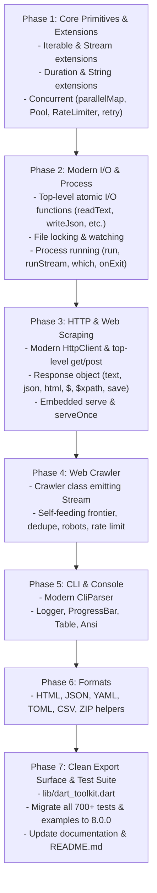

# dart-toolkit 8.0.0: Architecture & Redesign Plan

> **Version**: 8.0.0-dev  
> **Status**: Proposed / Under Review  
> **Target**: Dart 3.10+ (Modern Idiomatic Dart)  
> **Theme**: *Old convention out of the window.* Maximum DX, concise & idiomatic Dart, zero bloat, high performance.

---

## 1. Executive Summary & Vision

In versions 1.x through 7.x, `dart-toolkit` was guided by a rigid namespace philosophy documented in `NAMESPACE.md`:
- Every operation had to belong to one of eight faux-namespace singleton objects (`io.*`, `net.*`, `system.*`, `concurrent.*`, `util.*`, `format.*`, `cli.*`, `collection.*`).
- Methods were forced into one-word, lowercase names (`io.has`, `system.on.exit`, `util.text.slug`, `format.zip.pack`, `io.dump`).
- It attempted to replace Dart's core `Iterable`, `Map`, and `Stream` with custom container wrappers (`Sequence`, `Dictionary`, `Flow`) powered by esoteric dot-shorthand builders (`.through(.flat.map(...))`, `.collect(.join('\n'))`).

While conceptually ambitious, this created significant friction in practice:
1. **Poor DX & Discoverability**: Dart developers expect top-level functions, standard classes, and extension methods. Faux namespaces break natural autocomplete in IDEs.
2. **Friction with Dart Idioms**: Forcing lowercase one-word names conflicted with Effective Dart `lowerCamelCase`.
3. **Pipeline Overhead & Bloat**: Re-wrapping native Dart `Iterable` and `Stream` into `Sequence`, `Flow`, `Transformer`, `Collector`, `Pipe`, and `Pour` introduced substantial closure allocations, boilerplate, and cognitive load.

### The 8.0.0 Vision
For **8.0.0**, the old pseudo-namespace convention is completely abandoned:
- **Idiomatic Dart First**: Embrace top-level functions (`readText`, `writeJson`, `run`, `get`, `post`, `delay`, `retry`), first-class classes (`HttpClient`, `Crawler`, `CliParser`, `ProgressBar`, `Pool`), and rich extensions on native Dart types (`Iterable`, `Stream`, `String`, `Duration`).
- **Maximum Developer Experience (DX)**: Code is concise, predictable, auto-completable, and readable without having to consult a 900-line `NAMESPACE.md`.
- **High Performance & Zero Bloat**: Delete hundreds of lines of wrapper classes (`Transformer`, `Collector`, `Pipe`, `Pour`, `Slot`, `Sequence`, `Dictionary`, `Flow`, and 20+ `*Accessor` classes). Native Dart 3 collections and streams are used directly.
- **Retain Core Superpowers**: Keep the battle-tested, robust underlying engines: atomic filesystem writes with crash safety, signal/process lifecycle management, jQuery/XPath HTML parsing, robust HTTP client with retry and cookie sessions, and the self-feeding crawler frontier.

---

## 2. At a Glance: 7.x vs 8.0.0

| Domain / Area | 7.x (Namespace Approach) | 8.0.0 (Idiomatic Dart & Modern DX) | Discoverable Static Hub |
| :--- | :--- | :--- | :--- |
| **HTTP Requests** | `net.http.get(url)`, `net.http.post(url)` | `get(url)`, `post(url)` | `Http.get(...)`, `Http.post(...)` |
| **HTTP Response** | `Reply` (`res.body`, `res.parse(...)`) | `Response` (`res.text`, `res.json`, `res.html`, `res.$('a')`) | `Response` |
| **Web Crawling** | `net.crawl([Fetch(url)].seq, next)..concurrent(4)` | `crawl([url], next)` -> `Stream<Response>` | `Http.crawl(...)` |
| **Atomic File Write** | `io.write(path, text)`, `io.dump(path, data)` | `writeText(path, text)`, `writeJson(path, data)` | `Files.writeText(...)`, `Files.writeJson(...)` |
| **File Read** | `io.read(path)`, `io.lines(path)` | `readText(path)`, `readLines(path)`, `readJson(path)` | `Files.readText(...)`, `Files.readJson(...)` |
| **Path Manipulation**| `io.path.join(...)`, `io.path.dirname(...)` | `p.join(...)` (re-exported `path`) | `p.join(...)`, `p.dirname(...)` |
| **Directories** | `io.dir.list(path)`, `io.dir.walk(path)` | `listDir(path)`, `walkDir(path)`, `makeDir(path)` | `Files.list(...)`, `Files.walk(...)` |
| **File Locking** | `io.lock(path, () => ...)` | `withLock(path, () => ...)` | `Files.lock(...)` / `IO.lock(...)` |
| **Subprocesses** | `system.run('git', ['status'])` | `run('git', ['status'])` -> `ProcessResult` with `.ok` | `System.run(...)` / `Sys.run(...)` |
| **Process Cleanup** | `system.on.exit(...)`, `system.shutdown()` | `onExit(...)`, `shutdown([code])` | `System.onExit(...)`, `System.shutdown(...)` |
| **Environment** | `system.env.get('K')`, `system.env.load()` | `env['K']`, `env.get('K', default)`, `loadEnv()` | `Env['K']`, `Env.get(...)`, `Env.load()` |
| **Concurrency** | `concurrent.run(items, worker, size: 4)` | `items.parallelMap(worker, concurrency: 4)` | `Concurrent.map(...)` |
| **Failure Tolerance**| `concurrent.settle(items, worker)` | `items.settle(worker)` -> `List<Settled<T>>` | `Concurrent.settle(...)` |
| **Rate Limiting** | `concurrent.rate(10, per: 1.s)` | `RateLimiter(10, per: 1.seconds)` | `Concurrent.rate(...)` |
| **Retry with Backoff**| `concurrent.retry(fn, retries: 3)` | `retry(fn, retries: 3, backoff: 100.ms)` | `Concurrent.retry(...)` |
| **Collections** | `Sequence`, `Dictionary`, `Flow`, `.through(...)` | Native `Iterable<T>` & `Stream<T>` extensions | `.chunk()`, `.sortedBy()`, `.groupBy()` |
| **CLI Arguments** | `cli.flag(...)`, `cli.parse(args)` | `CliParser()`, `args.flag('f')` | `CliParser()` |
| **Formats** | `format.html`, `format.json`, `format.zip` | `parseHtml()`, `parseJson()`, `zip()`, `unzip()` | `Formats.json(...)`, `Formats.zip(...)` |
| **Utilities** | `util.time.wait(250.ms)`, `util.text.slug(s)` | `delay(250.ms)`, `s.toSlug()`, `sha256Hash(s)` | `Text.slug(...)`, `Time.format(...)`, `Hash.sha256(...)` |

---

## 3. Detailed Redesign by Area

### 3.1 Collections & Pipelines: Native Dart 3

#### What is removed:
- `Sequence<T>`, `Dictionary<T>`, `Flow<T>`
- `Transformer<A, B>`, `Collector<A, B>`, `Pipe<A, B>`, `Pour<A, B>`
- `Slot<T>`
- The cumbersome `.through(...)`, `.transform(...)`, and `.collect(...)` method chains.

#### What replaces them:
Lightweight, zero-overhead extension methods directly on `Iterable<T>` and `Stream<T>`:

```dart
// Native Iterable extensions:
final items = ['apple', 'banana', 'avocado'];
items.filter((s) => s.startsWith('a'));         // Alias for where
items.sortedBy((s) => s.length);                 // Sort by comparable key
items.sortedByDescending((s) => s.length);       // Sort descending
items.distinct();                                // Deduplicate
items.distinct((s) => s[0]);                     // Deduplicate by selector
items.chunk(2);                                  // Chunk into batches: [['apple', 'banana'], ['avocado']]
items.window(2);                                 // Sliding window
items.groupBy((s) => s[0]);                      // Map<String, List<String>>
items.countBy((s) => s[0]);                      // Map<String, int>
items.mapNotNull((s) => s.isEmpty ? null : s);   // Map filtering out nulls

// Native Stream extensions:
final stream = Stream.fromIterable([1, 2, 3, 4, 5]);
await stream
    .parallelMap((n) => fetchItem(n), concurrency: 3)
    .chunk(10)
    .listen((batch) => ...);
```

---

### 3.2 Networking, Scraping & Crawling

#### 3.2.1 Top-Level HTTP Helpers & HttpClient
For rapid scripting, top-level HTTP functions execute immediately using a shared, pooled client:
```dart
final res = await get('https://api.github.com/users/octocat');
if (res.ok) {
  print(res.json['name']);
}
```
Top-level functions:
- `Future<Response> get(UriOrString url, {Map<String, String>? headers, Duration? timeout, int retries = 0})`
- `Future<Response> post(UriOrString url, {Object? body, Map<String, String>? headers, ...})`
- `Future<Response> put(UriOrString url, ...)`
- `Future<Response> delete(UriOrString url, ...)`
- `Future<Response> patch(UriOrString url, ...)`
- `Future<Response> head(UriOrString url, ...)`
- `Future<File> download(UriOrString url, String destinationPath, {void Function(int received, int total)? onProgress})`

For long-running sessions, authentication, custom proxies, and connection pooling:
```dart
final http = HttpClient(
  baseHeaders: {'Authorization': 'Bearer $token'},
  timeout: 30.seconds,
  retries: 3,
  cookies: CookieJar(),
);
final res = await http.get('https://example.com');
```

#### 3.2.2 The `Response` Object (Unified & Expressive)
`Response` carries status, headers, raw bytes, and on-demand, memoized representations:
```dart
final res = await get('https://news.ycombinator.com');

print(res.statusCode);   // 200
print(res.ok);           // true
print(res.text);         // Decoded string (respects charset / meta tags)
print(res.bytes);        // List<int>
print(res.json);         // Json cursor / dynamic value

// HTML & Selectors:
final markup = res.html;                         // Markup DOM cursor
final links = res.$('a.storylink');              // jQuery-like shorthand
final titles = res.$$('.titleline > a')          // Find all matches
    .map((el) => el.text)
    .toList();

// Saving to disk atomically:
await res.save('page.html');

// Generating next request:
final nextReq = res.follow('/next?page=2');
```

#### 3.2.3 The Web Crawler (`Crawler`)
A clean, builder-free or named-parameter `Crawler` that emits a native `Stream<Response>`:
```dart
final crawler = Crawler(
  concurrency: 4,
  delay: 200.ms,
  maxDepth: 3,
  sameHost: true,
  obeyRobots: true,
);

// Seeds can be Uris, Strings, or Request objects:
final stream = crawler.crawl(
  ['https://shop.test/catalogue'],
  next: (res) => [
    for (final href in res.$$('a.product').map((a) => a.attr('href')!))
      res.follow(href, tag: 'product'),
    if (res.$('a.next').attr('href') case final next?)
      res.follow(next),
  ],
);

await for (final res in stream) {
  if (res.tag == 'product') {
    print('Product: ${res.$('h1').text}');
  }
}
```

#### 3.2.4 Embedded Server for Tooling & OAuth
```dart
// Start a lightweight local server:
final server = await serve(8080, (req) async {
  if (req.path == '/health') return Response.json({'status': 'ok'});
  return Response.notFound();
});

// Single-shot server for OAuth callbacks / CLI confirmations:
final code = await serveOnce(8080, (req) => req.query['code']);
```

---

### 3.3 Filesystem & I/O: Safe, Atomic, and Intuitive

All file writes remain **atomic by default** (staging through a `.part` temporary file and renaming), preventing file corruption if scripts are terminated mid-write.

#### Top-Level I/O Functions:
```dart
// Reading
final text = await readText('data.txt');
final lines = await readLines('access.log');
final json = await readJson('config.json');
final bytes = await readBytes('image.png');

// Sync variants for quick CLI scripts:
final syncText = readTextSync('data.txt');
final syncJson = readJsonSync('config.json');

// Writing (atomic by default)
await writeText('output/report.txt', 'Done');
await writeLines('output/lines.txt', ['line 1', 'line 2']);
await writeJson('output/data.json', {'count': 42}, pretty: true);
await writeBytes('output/binary.dat', bytes);

// Checking existence & metadata
if (fileExists('output/data.json')) { ... }
if (dirExists('output')) { ... }
final stat = fileStat('output/data.json'); // size, modified, isFile

// Directory operations
await makeDir('output/nested/dir');
await removePath('output/temp');
final entries = await listDir('output');
final allCsvs = await walkDir('output', match: '*.csv');

// File locking (safe across OS processes)
await withLock('sync.lock', () async {
  // guaranteed single-process execution
});

// File watcher (debounced)
final unwatch = watch('lib', (path) {
  print('Changed: $path');
});
```

#### Path Utilities:
Standard `package:path` functions are re-exported directly at top level or through a clean `p` alias:
```dart
final fullPath = joinPath('output', 'reports', '2026.json');
final dir = dirname(fullPath);
final name = filename(fullPath);
final stem = stemName(fullPath); // '2026'
final ext = fileExtension(fullPath); // '.json'
```

---

### 3.4 Concurrency, Rate Limiting & Synchronization

Instead of `concurrent.*`, expose concise, battle-tested utilities:

```dart
// 1. Parallel mapping over collections:
final results = await urls.parallelMap(
  (url) => get(url),
  concurrency: 5,
  delay: 50.ms,
);

// 2. Failure-tolerant concurrency (does not abort all on one failure):
final outcomes = await urls.settle(
  (url) => get(url),
  concurrency: 5,
);
for (final outcome in outcomes) {
  switch (outcome) {
    case Done(:final value): print('Success: ${value.url}');
    case Broke(:final error): print('Failed: $error');
  }
}

// 3. Robust retry with backoff & jitter:
final data = await retry(
  () => fetchUnstableResource(),
  retries: 3,
  backoff: 200.ms,
  onRetry: (err, attempt) => print('Retrying $attempt: $err'),
);

// 4. Rate Limiter (Token Bucket):
final limiter = RateLimiter(10, per: 1.seconds);
await limiter.guard(() => get('https://api.github.com'));

// 5. Counting Semaphore:
final sem = Semaphore(3);
await sem.guard(() => performWork());

// 6. Simple delays:
await delay(250.ms);
```

---

### 3.5 System, Processes & Environment

Instead of `system.run`, `system.env`, `system.on`:

```dart
// 1. Running subprocesses:
final result = await run('git', ['status', '--short']);
if (result.ok) {
  print(result.stdout);
} else {
  print('Error (${result.exitCode}): ${result.stderr}');
}

// Streaming output:
await runStream('npm', ['install'], onStdout: print);

// Executable lookup:
final gitPath = which('git');

// 2. Environment variables:
loadEnv(); // Loads .env file if present
final apiKey = env['API_KEY'] ?? env.get('API_KEY', 'default_key');

// 3. Graceful shutdown and signal safety:
onExit(() async {
  print('Cleaning up temp files before exit...');
  await removePath('.tmp');
});

// Cleanly terminate:
shutdown(0);
```

---

### 3.6 CLI & Terminal Tooling

Instead of the stateful `cli.*` accessor:

```dart
final cli = CliParser(
  name: 'scraper',
  description: 'Scrapes shop catalogue and exports data',
);

final force = cli.flag('force', abbr: 'f', help: 'Overwrite existing files');
final size = cli.option<int>('concurrency', abbr: 'c', defaultValue: 4, help: 'Concurrent requests');
final query = cli.argument('query', help: 'Search query');

// Parse args:
final options = cli.parse(args);

if (options.flag('help')) {
  cli.printUsage();
  return;
}

// Terminal Output & Progress:
logger.step(1, 3, 'Crawling...');
final progress = ProgressBar(total: 100, message: 'Downloading');
progress.tick();
progress.done();

// ANSI styling:
print(ansi.green('Success!'));
print(ansi.red('Error: Something broke'));

// Formatted tables:
print(Table(
  headers: ['ID', 'Name', 'Price'],
  rows: [
    ['1', 'Keyboard', '\$89.00'],
    ['2', 'Mouse', '\$29.50'],
  ],
).render());
```

---

### 3.7 Formats & Codecs

Clean, direct parsing and serialization without `format.*`:
```dart
// HTML
final doc = parseHtml('<html>...</html>');
print(doc.$('h1').text);

// JSON
final json = parseJson('{"a": 1}');
final jsonStr = toJsonString(data, pretty: true);

// YAML & TOML
final yaml = parseYaml(yamlContent);
final toml = parseToml(tomlContent);

// CSV
final records = parseCsv('name,age\nAlice,30');
final csvStr = toCsvString([{'name': 'Alice', 'age': 30}]);

// Archives (Zip / Tar.gz)
await zip('output/dist', 'archive.zip');
await unzip('archive.zip', 'output/extracted');
```

---

### 3.8 Pure Utilities & Extensions

```dart
// Duration extensions:
250.ms
5.seconds
10.minutes
2.hours

// String extensions:
'Hello World!'.toSlug();            // 'hello-world'
'  lots   of   spaces  '.clean();  // 'lots of spaces'
r'$1,234.50'.extractNumber();       // 1234.5

// Hashing:
sha256Hash('my-string');
md5Hash('my-string');

// Randomness:
randomInt(min: 1, max: 10);
jitter(100.ms, percentage: 0.25);   // 75ms to 125ms
```

---

## 4. Code Comparison: 7.x Pipeline vs 8.0.0 Pipeline

Let's compare the end-to-end catalogue crawler example in both versions:

### In 7.x:
```dart
import 'package:dart_toolkit/dart_toolkit.dart';

void main(List<String> args) async {
  final force = cli.flag('force', alias: 'f');
  final size = cli.number('concurrency', alias: 'c', def: 4);
  cli.parse(args);

  system.env.load();
  final log = system.console.logger;
  final out = system.console.writer;

  system.on.exit(() => log.debug('Cleaning up...'));

  log.step(1, 3, 'Crawling...');
  final crawl = net.crawl([Fetch('https://shop.test/catalogue'.url)].seq)
    ..concurrent(size())
    ..delay(util.rand.jitter(20.ms))
    ..sameHost();

  final products = await crawl.flow
      .through(.where((res) => res.fetch.tag == 'product'))
      .through(.flat.map((res) => [
            (
              name: res.parse(format.html).$('h1').text,
              price: util.text.number(res.parse(format.html).$('.price').text) ?? 0,
            )
          ]))
      .toList();

  log.step(2, 3, 'Enriching...');
  final enriched = await concurrent.run(products, (p) async {
    return {
      'name': p.name,
      'price': p.price,
      'slug': util.text.slug(p.name),
      'hash': util.hash.sha(p.name).substring(0, 8),
    };
  }, size: size());

  log.step(3, 3, 'Saving...');
  io.dump('output/products.json', enriched);
  io.csv.write('output/products.csv', enriched);

  await format.zip.pack('output/products.json', 'output/archive.tar.gz');
  await system.shutdown();
}
```

### In 8.0.0:
```dart
import 'package:dart_toolkit/dart_toolkit.dart';

void main(List<String> args) async {
  final cli = CliParser()
    ..flag('force', abbr: 'f')
    ..option<int>('concurrency', abbr: 'c', defaultValue: 4);
  final options = cli.parse(args);

  loadEnv();
  onExit(() => logger.debug('Cleaning up...'));

  logger.step(1, 3, 'Crawling...');
  final crawler = Crawler(
    concurrency: options.get('concurrency'),
    delay: jitter(20.ms),
    sameHost: true,
  );

  final products = await crawler
      .crawl(['https://shop.test/catalogue'])
      .where((res) => res.tag == 'product')
      .map((res) => (
            name: res.$('h1').text,
            price: res.$('.price').text.extractNumber() ?? 0,
          ))
      .toList();

  logger.step(2, 3, 'Enriching...');
  final enriched = await products.parallelMap((p) async {
    return {
      'name': p.name,
      'price': p.price,
      'slug': p.name.toSlug(),
      'hash': sha256Hash(p.name).substring(0, 8),
    };
  }, concurrency: options.get('concurrency'));

  logger.step(3, 3, 'Saving...');
  await writeJson('output/products.json', enriched);
  await writeCsv('output/products.csv', enriched);

  await zip('output/products.json', 'output/archive.zip');
}
```

**Takeaways from the comparison**:
1. Zero `.through(...)`, zero `.seq`, zero `.parse(format.html)`.
2. Native `Stream` operations (`where`, `map`, `toList`).
3. Clean, top-level atomic functions (`writeJson`, `writeCsv`, `zip`, `loadEnv`, `onExit`).
4. Concise and self-explanatory extensions (`p.name.toSlug()`, `text.extractNumber()`, `products.parallelMap(...)`).
5. Standard, non-leaky CLI parser.

---

## 5. Architecture & Codebase Layout

```
lib/
├── dart_toolkit.dart         # Main unified export library
├── crawler.dart              # Specialized crawler exports (for modular usage)
├── io.dart                   # Filesystem & atomic IO exports
├── cli.dart                  # Command line parser & console styling
│
└── src/
    ├── crawler/              # Crawler engine, frontier, crawl stream
    │   ├── crawler.dart
    │   ├── frontier.dart
    │   ├── robots.dart
    │   └── sitemap.dart
    ├── http/                 # Modern HTTP client, Response, Request, Cookies
    │   ├── client.dart
    │   ├── response.dart
    │   ├── request.dart
    │   ├── cache.dart
    │   └── server.dart       # Embedded serve() and serveOnce()
    ├── io/                   # Safe atomic file system, locks, watch, path
    │   ├── file.dart
    │   ├── dir.dart
    │   ├── atomic.dart
    │   ├── lock.dart
    │   └── watch.dart
    ├── concurrent/           # Pool, parallelMap, RateLimiter, Semaphore, retry
    │   ├── parallel.dart
    │   ├── pool.dart
    │   ├── limiter.dart
    │   ├── semaphore.dart
    │   └── retry.dart
    ├── process/              # Subprocess run, stream, which, onExit hooks
    │   ├── run.dart
    │   ├── env.dart
    │   └── lifecycle.dart
    ├── cli/                  # Modern CliParser, options, flags, help
    │   ├── parser.dart
    │   └── args.dart
    ├── console/              # Logger, ProgressBar, Table, Ansi colors
    │   ├── logger.dart
    │   ├── progress.dart
    │   ├── table.dart
    │   └── ansi.dart
    ├── format/               # Codecs: HTML, JSON, YAML, TOML, CSV, ZIP
    │   ├── html.dart         # Markup, jQuery $, XPath
    │   ├── json.dart         # Json cursor, JsonPath
    │   ├── csv.dart          # CSV parser / writer
    │   ├── yaml.dart
    │   ├── toml.dart
    │   └── zip.dart
    └── extensions/           # Native extensions on Iterable, Stream, String, Duration
        ├── iterable.dart
        ├── stream.dart
        ├── string.dart
        └── duration.dart
```

---

## 6. Performance & Bloat Elimination

1. **Memory & Allocation Efficiency**:
   - Dropping `Transformer`, `Collector`, `Pipe`, `Pour`, `Sequence`, and `Flow` saves 3-5 object allocations per pipeline step.
   - Stream processing runs on native Dart `StreamSubscription` and `StreamTransformer` without redundant intermediate queues.
2. **Reduced Package Surface**:
   - Elimination of pseudo-accessors (`IoAccessor`, `NetAccessor`, `SystemAccessor`, `UtilAccessor`, `FormatAccessor`, `CliAccessor`, `PathAccessor`, `DirAccessor`, `LinesAccessor`, `BytesAccessor`, `ChunksAccessor`, `AppendAccessor`, etc.).
   - Over 3,000 lines of boilerplate namespace forwarding code deleted.
3. **Optimized I/O**:
   - Retains the rock-solid `.part` staging atomic rename system from `fs.dart`.
   - Direct `readText` / `writeText` paths avoid layers of accessor calls.

---

## 7. Migration Guide & Compatibility Notes

While 8.0.0 is a breaking major version redesign:
- **`@Deprecated` Compatibility Bridge (Optional / Phase 1)**:
  During early 8.0 development or for ease of migration, the old namespace symbols (`io`, `net`, `system`, `concurrent`, `util`, `format`, `cli`) can temporarily be retained as `@Deprecated('Use top-level functions instead')` proxies pointing to the new APIs, easing progressive migration for existing codebases before final cleanup.
- **Clear deprecation of `NAMESPACE.md`**:
  `NAMESPACE.md` will be marked as legacy historical reference for 7.x and earlier.

---

## 8. Implementation Roadmap



---

## 9. Phase 2: Complete Elimination of Legacy 7.x Code

With the completion of the modern 8.0 APIs (top-level functions, native Dart 3 extensions, and discoverable static hubs `Files`, `Http`, `System`, `Env`, `Concurrent`, `Formats`, `Text`, `Time`, `Hash`, `Size`, `Rand`), all remaining legacy traces are marked for immediate deletion:

### 9.1 Files and Components to Delete

1. **Pipeline & Container Wrappers**:
   - `lib/collection/transformer.dart` (`Transformer` class and dot-shorthands)
   - `lib/collection/collector.dart` (`Collector` class and dot-shorthands)
   - `lib/collection/pipe.dart` (`Pipe` and `Pour` classes and dot-shorthands)
   - `lib/collection/slot.dart` (`Slot` typed keys)
   - `lib/collection/sequence.dart` (`IterablePipeline` with `.transform()`, `.collect()`, `.seq`)
   - `lib/collection/flow.dart` (`StreamPipeline` with `.through()`, `.collect()`, `.flow`)
   - `lib/collection/dictionary.dart` (`MapPipeline` with `.transform()`, `.collect()`, `.dict`)
   - `lib/collection/maps.dart` & `lib/collection/streams.dart`
2. **Legacy Accessors & Singletons**:
   - `IoAccessor`, `IoAsyncAccessor`, `DirAccessor`, `PathAccessor`, `LinesAccessor`, `BytesAccessor`, `ChunksAccessor`, `AppendAccessor`, `CsvFileAccessor`, `DiskState`
   - `NetAccessor`
   - `SystemAccessor`, `SysEvents`
   - `ConcurrentAccessor`
   - `FormatAccessor`
   - `UtilAccessor`
   - `CliAccessor`
   - `lib/io/collections.dart` (`Dumpable` extensions)
3. **Obsolete Test Suites**:
   - `test/sequence_test.dart`
   - `test/regression_test.dart`
   - `test/toolkit_test.dart`
   - `test/doc_samples_test.dart`
4. **Active Test Suite Migration**:
   - Update `test/crawler_pipeline_test.dart`, `test/form_test.dart`, `test/console_test.dart`, `test/docs_test.dart` to use native `List` / `Iterable` and modern 8.0 APIs.

