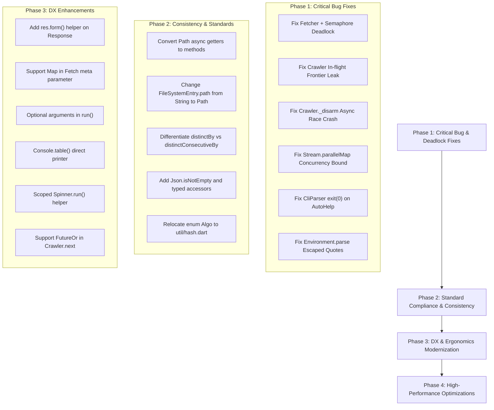

# Comprehensive Architectural Audit, 15 Use Cases & Modernization Plan for `dart-toolkit`

> **Vision**: Maximize developer experience (DX), conciseness, and runtime performance for automation, scripting, and web crawling pipelines in Dart 3.10+.

---

## Executive Summary

A deep architectural audit was conducted across every module of `dart-toolkit`:
- `lib/io/` (`path.dart`, `entry.dart`, `io.dart`) & `lib/src/fs.dart`, `entries.dart`, `lock.dart`, `watch.dart`
- `lib/net/` (`http.dart`, `crawl.dart`, `fetch.dart`, `form.dart`, `serve.dart`, `cache.dart`, `net.dart`)
- `lib/format/` (`csv.dart`, `form.dart`, `format.dart`, `html.dart`, `json.dart`, `robots.dart`, `sitemap.dart`, `toml.dart`, `yaml.dart`, `zip.dart`) & `lib/src/markup.dart`, `src/jquery.dart`, `src/json.dart`, `src/jsonpath.dart`, `src/csvtext.dart`
- `lib/cli/` (`cli.dart`, `opt.dart`, `parse.dart`, `spec.dart`, `usage.dart`)
- `lib/collection/` (`collection.dart`, `iterable_extensions.dart`, `iterables.dart`, `map_extensions.dart`, `maps.dart`, `stream_extensions.dart`, `streams.dart`)
- `lib/concurrent/` (`concurrent.dart`)
- `lib/system/` (`system.dart`, `env.dart`, `src/proc.dart`) & `lib/system/console/` (`ansi.dart`, `console.dart`, `logger.dart`, `progress.dart`, `reader.dart`, `spinner.dart`, `table.dart`, `terminal.dart`, `writer.dart`)
- `lib/util/` (`hash.dart`, `rand.dart`, `size.dart`, `text.dart`, `time.dart`, `util.dart`)

This audit uncovered **critical deadlock bugs, state corruption bugs, unhandled exception crashes, architectural layering violations, pervasive API inconsistencies, and cognitive clutter** that actively impede developer velocity.

---

## 1. Master List of Bugs, Architectural Defects & Performance Issues

### 1.1 CRITICAL BUG: `Fetcher` + `Semaphore` Permanent Deadlock
- **Location**: `lib/net/http.dart` (lines 915, 1020) & `lib/concurrent/concurrent.dart` (lines 395–465)
- **Defect**: The README explicitly states (line 535): *"Semaphore is how many at once and RateLimiter is how often; both implement Waiting, so a Fetcher can be paced by either"*.
  However, in `Fetcher.send` and `Fetcher.stream`, the code does:
  ```dart
  await limiter?.take();
  ```
  `Fetcher` **NEVER** calls `release()`! Furthermore, the `Waiting` interface doesn't even have a `release()` method (`Waiting` only exposes `take()` and `guard()`).
- **Consequence**: If a developer passes `Fetcher(limiter: Semaphore(5))`, the first 5 requests acquire permits. **On request #6, `await limiter?.take()` blocks forever because the permits are never released!** The entire crawler/script hangs indefinitely.
- **Fix**: Either `Fetcher` must wrap the request lifetime inside `limiter.guard(...)`, or `Waiting` must have a release mechanism that `Fetcher` invokes in a `finally` block once the response is received.

### 1.2 CRITICAL BUG: `Crawler._worker` Permanent Frontier State Leak on Failure
- **Location**: `lib/net/crawl.dart` (lines 600–632)
- **Defect**: `_inflight.remove(fetch)` is positioned *after* `await send(fetch)` and `_next?.call(reply)`. If `send(fetch)` throws (socket error, timeout, 5xx) or `_next` throws, execution jumps to `catch (error, stack) { _failed++; }` and `_inflight.remove(fetch)` is **never executed**.
- **Consequence**: Failed fetches remain in `_inflight` permanently. When `Crawler.position` is serialized, `_inflight` items are saved to `'pending'`. On resume, these failed requests are re-queued, causing infinite retry loops and permanent resume state corruption.
- **Fix**: Move `_inflight.remove(fetch)` into the `finally` block of the worker loop.

### 1.3 BUG / RACE CONDITION: `Crawler._disarm()` Asynchronous Background Crash
- **Location**: `lib/net/crawl.dart` (lines 527–533, 850–873)
- **Defect**: In `begin()`, if `_restoreFile()` throws (e.g. corrupt resume JSON), `controller.addError` delivers the error immediately to the caller (`crawler.run()`). The caller catches the error and teardown code deletes temporary directories. Meanwhile, `await _disarm()` is delayed. When it finally executes `if (file.existsSync()) await file.delete();`, the file or directory has been deleted concurrently, throwing an unhandled `PathNotFoundException` in the background zone and crashing the test suite or isolate.
- **Fix**: Guard file operations with `try/catch` and do not attempt to delete the resume file if initial restoration failed.

### 1.4 ARCHITECTURAL DEFECT: `Response.stream` Produces a Broken Object
- **Location**: `lib/net/http.dart` (`Response.stream`, lines 227–236, 283–297, 405–446)
- **Defect**: `Response.stream` instantiates `Response` with `bytes: null` (defaulting to `_rawBytes = const []`). Accessing `res.bytes`, `res.body`, `res.text`, `res.json`, or `res.parse(...)` silently returns empty data (`[]`, `""`) without warning or error.
- **Consequence**: Code expecting a normal response silently processes empty content.
- **Fix**: Disallow buffered property access on streamed responses (throw `StateError`), or provide `await res.readBytes()` / `await res.readText()`.

### 1.5 BUG: `CliParser.parse(..., autoHelp: true)` Abruptly Exits via `exit(0)`
- **Location**: `lib/cli/cli.dart` (line 109)
- **Defect**: Directly invokes `dart:io.exit(0)`, bypassing all `onExit` hooks and crashing test processes.
- **Fix**: Do not bypass shutdown; throw a caught `HelpException` or return a status flag.

### 1.6 BUG: `StreamExtensions.parallelMap` Concurrency Invariant Violation
- **Location**: `lib/collection/stream_extensions.dart` (lines 31–49)
- **Defect**: `if (active.length >= concurrency) sub?.pause();` is evaluated *before* `active.add(task)`. On event 1, `length` is 0 (does not pause). On event 2, pause is requested, but event 2 is still launched! If `concurrency == 1`, 2 tasks run concurrently.
- **Fix**: Pause the subscription synchronously when `active.length + 1 >= concurrency`.

### 1.7 BUG: `Environment.parse` Breaks on Escaped Quotes
- **Location**: `lib/system/env.dart` (lines 83–86)
- **Defect**: `value.indexOf(quote, 1)` stops at escaped quotes (`\"`), truncating values like `KEY="hello \"world\""`.
- **Fix**: Use an escape-aware token scanner.

### 1.8 DEFECT: `Lock` Zero-Byte Race Condition & Local Subprocess Overhead
- **Location**: `lib/src/lock.dart` (lines 65–71, 110–128, 142–175)
- **Defect**:
  1. Window between `file.createSync(exclusive: true)` and `file.writeAsStringSync(...)` creates an empty file. Another process reading it gets a parse error, treats it as `holder == null`, and refuses to clear it even if stale.
  2. `_alive(pid)` executes a synchronous subprocess (`kill -0 <pid>` on Unix, `tasklist` on Windows) every 100ms in a busy loop!
  3. `Lock` writes `'host': _hostname()`, but `_alive()` ignores host and checks PID locally, breaking network/NFS shares.
- **Fix**: Write content atomically, cache process liveness checks, and check hostname before testing local PIDs.

### 1.9 DEFECT: `Spinner` Leaks Cursor and Timer on Unhandled Exceptions
- **Location**: `lib/system/console/spinner.dart` (lines 65–94)
- **Defect**: If code between `spinner.start()` and `spinner.ok()` throws, the cursor remains permanently hidden (`\x1B[?25l`) and the timer runs forever.
- **Fix**: Provide a scoped `Spinner.run('Message', () async => ...)` that guarantees cursor restoration in a `finally` block.

---

## 2. 15 In-Depth Scripting Use Cases

---

### Use Case 1: E-Commerce Product Crawler & Form Submission
*Modules tested: `lib/net/http.dart`, `lib/net/form.dart`, `lib/format/form.dart`, `lib/src/markup.dart`*

#### The Script as Currently Written
```dart
import 'package:dart_toolkit/dart_toolkit.dart';

void main() async {
  final session = Fetcher(session: true);
  final res = await session.send(HttpMethod.get, 'https://shop.test/login'.url);

  // Difficulty 1: Form submission requires manual .at(res.url) and verbose syntax
  final loginForm = res.parse(.html).form('#login-form');
  if (loginForm == null) throw Exception('No form');
  final accountRes = await loginForm
      .at(res.url) // <-- Why must I pass res.url when I parsed it from res?
      .fill({'username': 'user', 'password': 'secret'})
      .send(using: session.call); // <-- Verbose session call syntax

  // Difficulty 2: Reading OpenGraph / Head tags
  final title = accountRes.$('title').text;
  final ogImage = accountRes.$('meta[property="og:image"]').attr('content');

  // Difficulty 3: res.follow() forces record syntax for metadata
  final nextLink = accountRes.$('a.orders').attr('href')!;
  final fetch = accountRes.follow(
    nextLink,
    meta: [('source', 'account'), ('priority', 1)], // <-- Cannot pass a Map!
  );

  // Difficulty 4: res.save() returns FileSystemEntry rather than Path
  final savedEntry = await accountRes.save('account.html');
  await Path(savedEntry.path).copyTo('backup.html'); // <-- Had to re-wrap Path!
}
```

#### Difficulties & Friction
1. `Response` doesn't provide a direct `.form()` accessor, forcing `res.parse(.html).form(...)!.at(res.url)`.
2. `res.follow()` refuses standard `Map<String, Object?>` for metadata, forcing `Iterable<(String, Object?)>`.
3. `res.save()` returns `FileSystemEntry` instead of `Future<Path>`, breaking fluid method chaining.

#### Proposed Modernized API
```dart
// Modernized DX:
final accountRes = await res.form('#login-form')
    ?.fill({'username': 'user', 'password': 'secret'})
    .submit(session);

final fetch = accountRes.follow(nextLink, meta: {'source': 'account', 'priority': 1});
final savedPath = await accountRes.save('account.html');
await savedPath.copyTo('backup.html');
```

---

### Use Case 2: Multi-Host Crawler with Robots.txt & Resume State
*Modules tested: `lib/net/crawl.dart`, `lib/format/robots.dart`, `lib/net/cache.dart`*

#### The Script as Currently Written
```dart
import 'package:dart_toolkit/dart_toolkit.dart';

void main() async {
  // Difficulty 1: Crawler.next cannot be asynchronous!
  // If we need an async check (e.g. database lookup, token check), we cannot do it in next.
  final crawler = crawl(
    ['https://news.ycombinator.com'],
    concurrency: 4,
    robots: .obey('MyBot/1.0'),
    politeness: .perHost(250.ms),
    resume: 'crawler.state',
    next: (res) {
      // Must be purely synchronous:
      return res.$$('.titleline > a')
          .map((a) => a.attr('href'))
          .whereType<String>()
          .map((url) => res.follow(url, tag: 'article'));
    },
  );

  // Difficulty 2: Stopping crawler and checking stats
  final stats = await crawler.run();
  print('Fetched: ${stats.fetched}, Failed: ${stats.failed}');
}
```

#### Difficulties & Friction
1. `next` callback only accepts synchronous `Iterable<Fetch> Function(Response res)`. Real-world crawlers frequently require `Future<Iterable<Fetch>>` for database deduplication, Bloom filter checks, or async token refresh.
2. In-flight request leak bug (Bug 1.2) causes failed crawls to poison `crawler.state` on resume.

#### Proposed Modernized API
```dart
// Allow FutureOr in next:
crawl(
  ['https://news.ycombinator.com'],
  next: (res) async {
    final urls = res.$$('.titleline > a').attrs('href');
    final freshUrls = await db.filterNew(urls);
    return freshUrls.map((u) => res.follow(u));
  },
);
```

---

### Use Case 3: Parsing XML Sitemaps into a Crawler Seed
*Modules tested: `lib/format/sitemap.dart`, `lib/net/http.dart`*

#### The Script as Currently Written
```dart
import 'package:dart_toolkit/dart_toolkit.dart';

void main() async {
  final res = await Http.get('https://example.com/sitemap.xml'.url);

  // Difficulty 1: Sitemap format is List<Uri>, but crawl seeds take Iterable<Object>
  // Parsing sitemap requires:
  final List<Uri> sitemapUrls = res.text.parse(.sitemap);

  // Difficulty 2: Nested sitemap index detection
  // SitemapFormat().nested(res.text) is a method on the codec class, not accessible via dot shorthand
  final isIndex = const SitemapFormat().nested(res.text);

  if (isIndex) {
    print('Sitemap index with ${sitemapUrls.length} sub-sitemaps');
  }
}
```

#### Difficulties & Friction
1. `res.parse(.sitemap)` returns `List<Uri>`, but `SitemapFormat.nested()` is not accessible through `res.parse` or shorthand.
2. No direct `res.sitemap` helper despite sitemaps being a primary crawler feature.

#### Proposed Modernized API
```dart
final sitemap = res.sitemap; // Direct accessor
if (sitemap.isIndex) {
  print('Sub-sitemaps: ${sitemap.urls.length}');
}
```

---

### Use Case 4: Deep JSON & JSONPath API Data Extraction
*Modules tested: `lib/format/json.dart`, `lib/src/json.dart`, `lib/src/jsonpath.dart`*

#### The Script as Currently Written
```dart
import 'package:dart_toolkit/dart_toolkit.dart';

void main() async {
  final res = await Http.get('https://api.github.com/repos/dart-lang/sdk/issues'.url);

  // Difficulty 1: 4 ways to read JSON on response
  // res.json vs res.decodeJson<T>() vs res.parse(.json) vs res.body.parse(.json)
  final doc = res.json;

  // Difficulty 2: Missing integer / double accessors
  final totalCount = doc.number('total_count')?.toInt() ?? 0; // verbose cast

  // Difficulty 3: Booleans are called flag()
  final isClosed = doc.flag('closed') ?? false;

  // Difficulty 4: Json has isEmpty, but refuses to provide isNotEmpty!
  if (!doc.at('items').isEmpty) { // Cannot write doc.at('items').isNotEmpty
    // Difficulty 5: jsonPath returns List<Json>, but cannot easily unwrap values
    final titles = doc.jsonPath(r'$..title').map((j) => j.text()).nonNulls.toList();
    print('Found ${titles.length} issues');
  }
}
```

#### Difficulties & Friction
1. `doc.number()?.toInt()` is required everywhere because `doc.integer()` does not exist.
2. `doc.flag()` is misleading terminology for JSON documents.
3. `Json.isNotEmpty` is missing, breaking consistency with Dart collections and `Markup`.

#### Proposed Modernized API
```dart
final doc = res.json;
final totalCount = doc.integer('total_count') ?? 0;
final isClosed = doc.boolean('closed') ?? false;

if (doc.at('items').isNotEmpty) {
  final titles = doc.jsonPath(r'$..title').values<String>();
}
```

---

### Use Case 5: Multi-Format Configuration Pipeline (YAML, TOML, JSON, .env)
*Modules tested: `lib/format/yaml.dart`, `lib/format/toml.dart`, `lib/format/json.dart`, `lib/system/env.dart`, `lib/io/path.dart`*

#### The Script as Currently Written
```dart
import 'package:dart_toolkit/dart_toolkit.dart';

void main() async {
  // 1. Load .env
  loadEnv();
  // Difficulty 1: env.value<T> requires explicit fallback
  final port = env.value<int>('PORT', 8080);
  final token = env['API_TOKEN'];

  // 2. Read pubspec.yaml
  final pubspec = await Path('pubspec.yaml').read(.yaml);
  final version = pubspec.text('version');

  // 3. Read Cargo.toml
  final cargo = await Path('Cargo.toml').read(.toml);
  final name = cargo.text('package.name');

  // 4. Write back merged config to JSON
  // Difficulty 2: Cannot write a Map directly via write(.json)
  // Must use writeJson or write(..., as: .json)
  await Path('config.json').writeJson({
    'port': port,
    'version': version,
    'name': name,
  });
}
```

#### Difficulties & Friction
1. `Environment.parse()` breaks if a `.env` variable contains escaped quotes (Bug 1.7).
2. `Path.write` requires `as: .yaml`, while JSON has a separate `Path.writeJson` member.

#### Proposed Modernized API
```dart
// Fixed .env parser supporting quotes
loadEnv();
final port = env.integer('PORT', fallback: 8080);

// Consistent read and write across all DocumentFormats
final pubspec = await Path('pubspec.yaml').read(.yaml);
await Path('out.yaml').write(pubspec.raw, as: .yaml);
```

---

### Use Case 6: High-Throughput Streaming CSV Transformation
*Modules tested: `lib/format/csv.dart`, `lib/src/csv.dart`, `lib/io/path.dart`*

#### The Script as Currently Written
```dart
import 'package:dart_toolkit/dart_toolkit.dart';

void main() async {
  final input = Path('large_dataset.csv');

  // 1. Stream records
  final records = input.csvRecords();

  final transformed = records.map((r) => {
    'id': r['ID'] ?? '',
    'email': r['Email']?.toLowerCase() ?? '',
    'status': (r['Active'] == '1') ? 'active' : 'inactive',
  });

  // 2. Write back to CSV
  // Difficulty 1: Path.writeCsv ONLY accepts Stream, not List!
  // If we had a List of rows, we cannot do Path('out.csv').writeCsv(list)
  await Path('clean.csv').writeCsv(transformed);

  // Difficulty 2: In SyncPath, writeCsv takes Iterable, NOT Stream!
  // Path.writeCsv takes Stream; SyncPath.writeCsv takes Iterable. Inconsistent!
}
```

#### Difficulties & Friction
1. `Path.writeCsv` accepts only `Stream<Map<String, V>>`. In-memory collections require `Stream.fromIterable(...)`.
2. `Path.writeCsv` (Stream) and `SyncPath.writeCsv` (Iterable) have asymmetric type signatures.

#### Proposed Modernized API
```dart
// Path.writeCsv accepts Stream or Iterable seamlessly:
await Path('clean.csv').writeCsv(transformedRows);
await Path('clean.csv').writeCsv(inMemoryRowList);
```

---

### Use Case 7: File System Watcher & Live Rebuild Script
*Modules tested: `lib/io/path.dart`, `lib/src/watch.dart`*

#### The Script as Currently Written
```dart
import 'package:dart_toolkit/dart_toolkit.dart';

void main() async {
  final srcDir = Path('src');

  // Difficulty 1: Path.watch returns a teardown callback, NOT a Stream!
  // Cannot do: await for (final changed in srcDir.watch()) { ... }
  // Must provide a callback:
  final stopWatching = srcDir.watch((path) {
    // Difficulty 2: path passed to callback is raw String, NOT Path!
    print('Changed: ${Path(path).name}');
  }, pattern: RegExp(r'\.dart$'));

  await delay(10.s);
  await stopWatching();
}
```

#### Difficulties & Friction
1. `Path.watch` does not return a `Stream<Path>`. It returns `Future<void> Function()`, preventing stream operators (`debounce`, `take`, `where`).
2. The callback passes raw `String path` instead of `Path`.

#### Proposed Modernized API
```dart
// Idiomatic Dart Stream:
final subscription = srcDir.watch(pattern: r'\.dart$').listen((Path file) {
  print('Changed: ${file.name}');
});

// Or using await for:
await for (final file in srcDir.watch()) {
  rebuild(file);
}
```

---

### Use Case 8: Inter-Process Synchronization with File Locks
*Modules tested: `lib/io/path.dart`, `lib/src/lock.dart`*

#### The Script as Currently Written
```dart
import 'package:dart_toolkit/dart_toolkit.dart';

void main() async {
  final lockFile = Path('app.lock');

  // Difficulty 1: Zero-byte window bug (Bug 1.8) can cause false deadlocks
  // Difficulty 2: Polling spawns synchronous sub-processes every 100ms
  await lockFile.lock(() async {
    print('Executing critical section with PID: $pid');
    await delay(1.s);
  }, wait: 5.s);

  // Difficulty 3: Lock.held() ignores hostname on network mounts
  if (lockFile.isLocked) {
    print('Still locked');
  }
}
```

#### Difficulties & Friction
1. Spawning subprocesses (`kill -0`) every 100ms creates significant CPU overhead during lock contention.
2. Empty lock creation window can cause lock acquisition to fail permanently if a creator dies mid-write.

#### Proposed Modernized API
```dart
// Atomic lock file creation + non-spawning PID liveness check
await lockFile.lock(() async {
  doWork();
}, timeout: 5.s);
```

---

### Use Case 9: Recursive Directory Walking & Bulk Cleanup
*Modules tested: `lib/io/path.dart`, `lib/io/entry.dart`, `lib/src/entries.dart`*

#### The Script as Currently Written
```dart
import 'package:dart_toolkit/dart_toolkit.dart';

void main() async {
  final outDir = Path('build');

  // Difficulty 1: Async getters violate Effective Dart
  // OutDir.dirSize and outDir.isDirEmpty are getters returning Future<T>!
  final totalBytes = await outDir.dirSize;
  final empty = await outDir.isDirEmpty;

  // Difficulty 2: FileSystemEntry.path is a String, NOT a Path
  final entries = await outDir.list(recursive: true);
  for (final entry in entries) {
    if (entry.isFile && entry.name.endsWith('.tmp')) {
      // Must wrap in Path() every time:
      await Path(entry.path).delete();
    }
  }

  // Difficulty 3: deleteFiles returns count, but is only sync in SyncPath
  final deleted = outDir.sync.deleteFiles(match: '*.tmp');
  print('Removed $deleted temporary files');
}
```

#### Difficulties & Friction
1. `Path.dirSize` and `isDirEmpty` are async getters violating Effective Dart.
2. `FileSystemEntry.path` is `String`, forcing repetitive `Path(entry.path)` re-wrapping.

#### Proposed Modernized API
```dart
final totalBytes = await outDir.dirSize(); // Method, not getter
final empty = await outDir.isDirEmpty();

for (final entry in await outDir.walk(match: '*.tmp')) {
  await entry.path.delete(); // entry.path is already a Path!
}
```

---

### Use Case 10: Archive Creation, Inspection & Safe Unzipping
*Modules tested: `lib/format/zip.dart`, `lib/io/path.dart`*

#### The Script as Currently Written
```dart
import 'package:dart_toolkit/dart_toolkit.dart';

void main() async {
  final dist = Path('dist');
  final zipPath = Path('dist.zip');

  // 1. Pack archive
  await dist.zipTo(zipPath);

  // 2. Inspect entries
  // Difficulty 1: ArchiveEntry uses "folder", not "isDir"
  // Difficulty 2: ArchiveEntry.name is the relative path, NOT the filename
  for (final entry in await zipPath.archiveEntries()) {
    if (entry.folder) { // <-- Why folder instead of isDir?
      print('Dir: ${entry.name}');
    } else {
      print('File: ${entry.name} (${entry.size} bytes)');
    }
  }

  // 3. Unpack into destination
  await zipPath.unzipInto('unpacked');
}
```

#### Difficulties & Friction
1. `ArchiveEntry.folder` is inconsistent with `FileSystemEntry.isDir` and `Path.isDir`.
2. `ArchiveEntry.name` contains the full path (e.g. `a/b/c.txt`), while `FileSystemEntry.name` contains the basename (`c.txt`).

#### Proposed Modernized API
```dart
for (final entry in await zipPath.archiveEntries()) {
  if (entry.isDir) { // Unified isDir
    print('Dir: ${entry.path}');
  }
}
```

---

### Use Case 11: Complex CLI Application with Subcommands
*Modules tested: `lib/cli/cli.dart`, `lib/cli/opt.dart`, `lib/cli/spec.dart`*

#### The Script as Currently Written
```dart
import 'package:dart_toolkit/dart_toolkit.dart';

void main(List<String> args) async {
  final parser = CliParser(syntax: 'tool <command> [options]');

  final verbose = parser.flag('verbose', abbr: 'v');
  final port = parser.number('port', defaultsTo: 8080);
  
  // Difficulty 1: Optional options default to empty strings
  // There is no way to declare an Opt<String?> without defaultsTo: ''
  final apiKey = parser.option('api-key');

  // Difficulty 2: autoHelp: true calls exit(0) directly
  parser.parse(args, autoHelp: true);

  // Difficulty 3: To check if an option was supplied vs default, must use .given()
  if (apiKey.given()) {
    print('Using key: ${apiKey()}');
  }
}
```

#### Difficulties & Friction
1. `autoHelp: true` abruptly terminates the Dart process with `dart:io.exit(0)`, preventing graceful cleanup.
2. `option()`, `number()`, `decimal()` cannot return nullable types `String?` / `int?` directly.

#### Proposed Modernized API
```dart
final apiKey = parser.optionalOption('api-key'); // Returns Opt<String?>
if (apiKey() != null) {
  print('Key: ${apiKey()}');
}
```

---

### Use Case 12: Terminal UI with Spinners, Progress Bars & Tables
*Modules tested: `lib/system/console/*`*

#### The Script as Currently Written
```dart
import 'package:dart_toolkit/dart_toolkit.dart';

void main() async {
  // Difficulty 1: Spinner leaks cursor if work throws
  final spinner = Spinner()..start('Connecting...');
  try {
    await delay(500.ms);
    spinner.ok('Connected');
  } catch (e) {
    spinner.fail('$e');
  }

  // Difficulty 2: Table requires verbose cascade and parentheses to render
  final table = Table(
    headers: ['Item', 'Status'],
    alignments: const [.left, .right],
  );
  table.addAll([
    ['Server', 'Running'],
    ['Database', 'Connected'],
  ]);
  // Printing table requires:
  Console.write(table.render());

  // Difficulty 3: Terminal.line() has a misleading name (it erases the line)
  Terminal().line();
}
```

#### Difficulties & Friction
1. `Spinner` lacks a scoped `Spinner.run(...)` helper, leaving terminals in a broken state on exceptions.
2. `Table` cannot be constructed with `rows: [...]` and lacks a direct `Console.table(...)` printer.
3. `Terminal.line()` should be `Terminal.clearLine()`.

#### Proposed Modernized API
```dart
// 1. Scoped spinner with guaranteed cursor recovery
await Spinner.run('Connecting...', () async => await connect());

// 2. Direct Console.table one-liner
Console.table(
  headers: ['Item', 'Status'],
  rows: [
    ['Server', 'Running'],
    ['Database', 'Connected'],
  ],
);

// 3. Clear terminal line
Terminal().clearLine();
```

---

### Use Case 13: Subprocess Pipelines & Graceful Shutdown
*Modules tested: `lib/system/system.dart`, `lib/src/proc.dart`*

#### The Script as Currently Written
```dart
import 'package:dart_toolkit/dart_toolkit.dart';

void main() async {
  // Difficulty 1: run() requires arguments list even when empty
  final uptime = await run('uptime', []); // Cannot do await run('uptime');

  // Difficulty 2: SysResult is an awkward name (Sys is not public)
  final res = await run('git', ['status', '--short']);
  if (res.ok) {
    print(res.stdout);
  }

  // Register shutdown
  onExit(() => print('Cleaning up...'));
  await shutdown(0);
}
```

#### Difficulties & Friction
1. `run(executable, arguments)` has mandatory positional `arguments`. Calling `run('uptime', [])` is clumsy.
2. `SysResult` is named after private `Sys` instead of standard `ProcessResult`.

#### Proposed Modernized API
```dart
await run('uptime'); // Optional arguments
await run('git', ['status', '--short']);
```

---

### Use Case 14: Rate-Limited Concurrent Scraping with Retries
*Modules tested: `lib/concurrent/concurrent.dart`, `lib/net/http.dart`*

#### The Script as Currently Written
```dart
import 'package:dart_toolkit/dart_toolkit.dart';

void main() async {
  final urls = [
    'https://api.test/1'.url,
    'https://api.test/2'.url,
  ];

  // Difficulty 1: retry requires mandatory "retries" parameter
  final res = await retry(() => Http.get(urls.first), retries: 3);

  // Difficulty 2: Semaphore passed to Fetcher causes DEADLOCK (Bug 1.1)
  final semaphore = Semaphore(2);
  final client = Fetcher(limiter: RateLimiter(5, per: 1.s)); // Only RateLimiter works

  // Difficulty 3: Stream.distinctBy vs Iterable.distinctBy inconsistency
  final distinctUrls = urls.distinctBy((u) => u.path); // Global dedupe
  final streamDistinct = Stream.fromIterable(urls).distinctBy((u) => u.path); // Only consecutive!
}
```

#### Difficulties & Friction
1. `retry()` should provide a sensible default (`retries: 3`).
2. Passing `Semaphore` to `Fetcher` deadlocks due to missing `release()`.
3. `distinctBy` behaves differently on `Stream` vs `Iterable`.

#### Proposed Modernized API
```dart
await retry(() => Http.get(url)); // Default retries: 3

// Stream consecutive dedupe renamed to avoid confusion
stream.distinctConsecutiveBy((e) => e.id);
```

---

### Use Case 15: Ephemeral Server for OAuth / Webhooks
*Modules tested: `lib/net/serve.dart`*

#### The Script as Currently Written
```dart
import 'package:dart_toolkit/dart_toolkit.dart';

void main() async {
  // Difficulty 1: Idiosyncratic naming Asked and Served
  final server = await serve(8080, (Asked req) async {
    // Difficulty 2: Exceptions in handler are swallowed silently!
    if (req.path == '/webhook') {
      return Served.json({'status': 'ok'});
    }
    return Served.status(404);
  });

  await server.close();
}
```

#### Difficulties & Friction
1. `Asked` and `Served` are unusual past-participle names.
2. Exceptions inside `handler` are completely swallowed by `catch (_)` and returned as silent 500s.

#### Proposed Modernized API
```dart
// Type aliases ServerRequest & ServerResponse
final server = await serve(8080, (ServerRequest req) async {
  return ServerResponse.json({'status': 'ok'});
}, onError: (err, stack) => logger.error('$err'));
```

---

## 3. Prioritized Action Plan & Modernization Blueprint



---

## 4. Verification Plan

1. **Unit & Stress Tests**:
   - `dart test test/crawler_test.dart`
   - `dart test test/resume_test.dart`
   - `dart test test/concurrency_test.dart`
2. **Docs Verification**:
   - `dart test test/docs_test.dart`
3. **Static Analysis**:
   - `dart analyze`
4. **End-to-End Pipeline Execution**:
   - `dart run example/example.dart`
