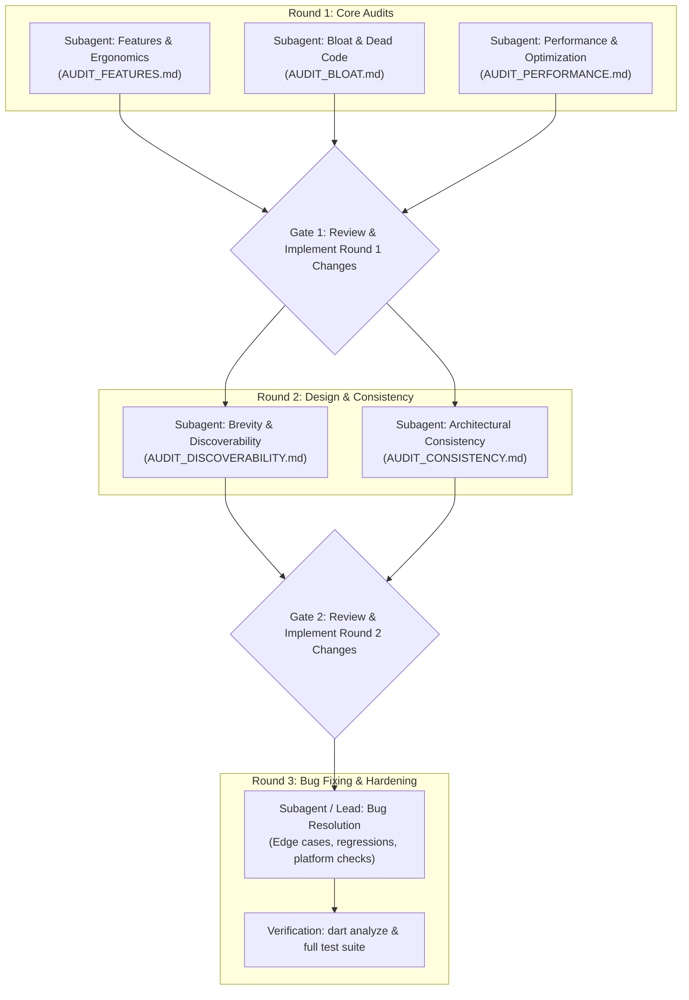

# Multi-Agent Audit & Modernization Workflow

This document defines the structured, three-round auditing and refinement workflow for the codebase. Orchestrating agents must execute this pipeline sequentially, spawning dedicated subagents for each audit domain, persisting findings into dedicated Markdown reports, and gating progression between rounds.

---

## Workflow Architecture Overview

---

## Round 1: Foundation Audits (Parallel Subagents)

The lead agent spawns three independent subagents concurrently. Each subagent reads the codebase and writes its findings and recommendations to its dedicated Markdown file.

### Subagent 1.1: Missing Features & API Ergonomics
- **Role**: `Feature & Ergonomics Auditor`
- **Output Target**: `AUDIT_FEATURES.md`
- **Scope**:
  - Identify missing capabilities compared to standard modern toolkits (e.g. streaming, HTTP methods, compression formats, XPath/DOM selectors).
  - Identify awkward, clunky, or high-friction API ergonomics (excessive boilerplate, awkward parameter requirements).
  - Propose clean signatures and examples of how new APIs should look and behave.

### Subagent 1.2: Bloat & Unnecessary Code
- **Role**: `Bloat & Simplification Auditor`
- **Output Target**: `AUDIT_BLOAT.md`
- **Scope**:
  - Identify redundant methods, redundant overloads, and loose extensions on primitive types that pollute namespace autocompletion.
  - Identify over-engineered abstractions or dead code paths that complicate maintenance without providing distinct utility.
  - Recommend exact classes, extensions, or methods that should be pruned or consolidated.

### Subagent 1.3: Performance & Optimization
- **Role**: `Performance Auditor`
- **Output Target**: `AUDIT_PERFORMANCE.md`
- **Scope**:
  - Identify hot-path bottlenecks, unnecessary buffer copies, and excessive memory allocations.
  - Review I/O and process execution (stream buffering, isolate boundaries, native FFI overhead).
  - Recommend concrete optimizations with algorithmic and memory impact analysis.

---

## Gate 1: Implementation & Consolidation

Before proceeding to Round 2:
1. The lead agent reviews `AUDIT_FEATURES.md`, `AUDIT_BLOAT.md`, and `AUDIT_PERFORMANCE.md`.
2. Plan and execute the accepted additions, prunings, and performance optimizations.
3. Validate compilation and tests (`dart analyze`, `dart test`).
4. Remove the intermediate Round 1 audit files once resolved or archive as needed.

---

## Round 2: API Refinement & Consistency (Parallel Subagents)

Once the codebase structure is refined from Round 1, the lead agent spawns two focused subagents to polish the public API experience.

### Subagent 2.1: API Brevity & Discoverability
- **Role**: `Discoverability Auditor`
- **Output Target**: `AUDIT_DISCOVERABILITY.md`
- **Scope**:
  - Evaluate how easy it is for an engineer starting from an empty file to discover functionality via autocomplete facades (e.g. `Http.*`, `Doc.*`, `Shell.*`, `Hash.*`, `Path.*`).
  - Balance brevity (clean operator syntax or concise method names) with discoverability, ensuring clean IDE completion without namespace pollution.
  - Identify naming mismatches that impede discoverability.

### Subagent 2.2: Architecture & Convention Consistency
- **Role**: `Consistency Auditor`
- **Output Target**: `AUDIT_CONSISTENCY.md`
- **Scope**:
  - Audit naming conventions across all modules (e.g. `ConsoleTheme` vs. `TuiTheme`, verb names in HTTP vs. Client).
  - Verify parameter ordering conventions across related functions.
  - Audit return type semantics (nullable vs non-nullable exceptions, `Either` vs thrown errors).
  - Ensure uniform adherence to repository conventions documented in `CONVENTIONS.md`.

---

## Gate 2: Implementation & Harmonization

Before proceeding to Round 3:
1. The lead agent reviews `AUDIT_DISCOVERABILITY.md` and `AUDIT_CONSISTENCY.md`.
2. Apply API renames, facade additions, and consistency alignments.
3. Update tests and documentation to reflect harmonized conventions.
4. Verify with `dart analyze` and relevant test suites.
5. Clean up Round 2 audit files.

---

## Round 3: Bug Fixing & Hardening

Round 3 focuses on correctness, reliability, and edge-case testing:
1. **Edge Case Resolution**:
   - Address silent failures, unhandled stream cancellations, and race conditions.
   - Audit cross-platform compatibility (Windows vs POSIX process handling, path casing, line endings).
   - Ensure atomic I/O guarantees (e.g. temporary-write-and-rename semantics).
2. **Verification Suite**:
   - Run `dart analyze` to ensure zero warnings or errors.
   - Run `dart test` across all unit, integration, and platform tests.
3. **Completion**:
   - Delete any temporary scratch scripts or transient audit files.
   - Commit and push all verified changes with concise, informative commit messages.
