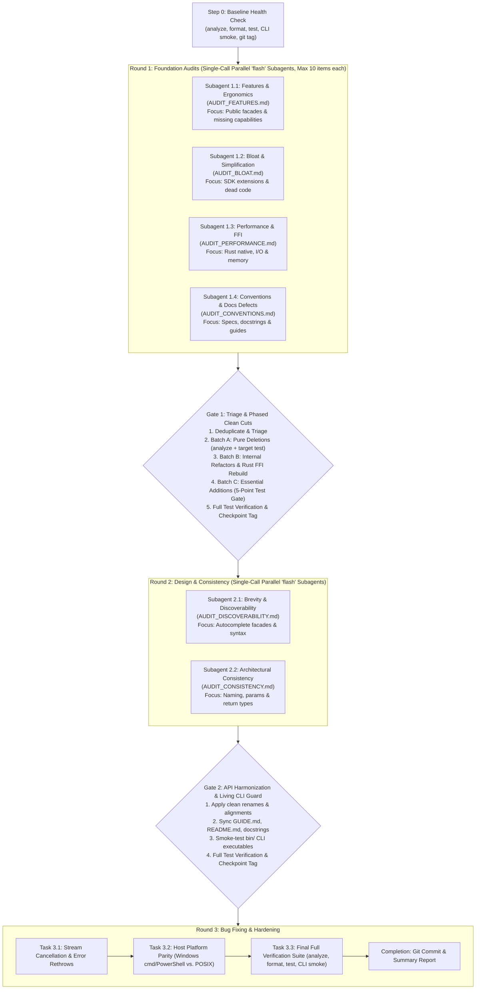

# Multi-Agent Audit & Modernization Workflow

This document defines the hardened, high-efficiency auditing and refinement workflow for the codebase. Orchestrating agents execute this pipeline sequentially, spawning focused subagents in parallel, persisting findings into compact Markdown reports, and gating progression between rounds with automated verification.

---

## Core Operating Principles

1. **Clean-Cut Policy (Zero Deprecations)**:
   - This is a personal project. **Never** use `@Deprecated` annotations, backward-compatibility wrapper shims, or legacy aliases.
   - When an API or extension is removed or renamed, make a clean cut: delete or rename it immediately, and update all call sites, examples, and tests across `lib/`, `bin/`, `tool/`, and `test/`.
2. **Gate 1 Triage Priority**:
   - When recommendations from different audit streams conflict, apply strict prioritization:
     $$\text{Bloat Pruning} > \text{API Ergonomics} > \text{Performance} > \text{Speculative Features}$$
   - Only accept new features if they fill genuine standard capabilities (e.g. streaming, missing HTTP verbs, DOM selectors), never speculative "nice-to-haves".
3. **Full Stack & Cross-Platform Scope**:
   - Audits cover Dart libraries (`lib/`), CLI tools (`bin/`), tests (`test/`), tooling (`tool/`), specifications (`CONVENTIONS.md`, `GUIDE.md`), and native Rust FFI (`native/src/*.rs`, `Cargo.toml`).
   - Cross-platform parity (Windows cmd/PowerShell vs. POSIX bash, path separators, file locking, and line endings) is a primary requirement.
4. **Decoupled Benchmark Guardrails**:
   - `tool/bench.dart` strictly measures **module startup and import compilation latency**, not runtime throughput. Startup time must not regress by >10 ms for any module.
   - Runtime performance refactors (FFI, hashing, compression, I/O) are verified via dedicated microbenchmarks or throughput tests (MB/s, memory allocations). If throughput gains are negligible (<5%) but complexity increases, reject the change.
5. **Speed & Token Optimization Rules**:
   - **Grep-First File Inspection**: Subagents must use `git grep` / symbol search before reading files, and call `view_file` only on precise line ranges (≤50 lines). Dumps of unchanged code are forbidden.
   - **Compact Output Schema**: Max 10 items, strictly formatted in <200 lines per report.
   - **No-Fluff Early Exit**: If a subagent finds no high/medium impact items, it outputs `NO_ACTIONABLE_ITEMS` and exits immediately.
   - **Parallel Single-Call Dispatch**: All subagents per round are spawned concurrently in a single `invoke_subagent` tool call using `Model: 'flash'`.
   - **Targeted Module Testing**: During iterative edits in Gate 1/2, run `dart analyze --fatal-infos` and *only the affected module's test* (`dart test test/<module>_test.dart`). Full test suites (`dart test`) run only once at gate completion.
6. **Two-Strike Rollback Protocol**:
   - Apply edits per item or micro-batch. Run `dart analyze --fatal-infos`.
   - If compilation fails, allow **one** corrective attempt (Strike 1).
   - If compilation still fails (Strike 2), **immediately rollback with `git reset --hard HEAD`**, mark the item `[REJECTED - COMPILATION FAILURE]`, and move to the next item. Never leave the working tree in a broken state.
7. **Audit Provenance (Archive, Don't Delete)**:
   - Instead of deleting audit reports, move them to `.audits/round1/` and `.audits/round2/`. This preserves the decision log, rejected items, and rationale for future reference.

---

## Workflow Architecture Overview



---

## Step 0: Baseline Health Check

Before spawning subagents:
1. **Compilation & Formatting Check**:
   ```bash
   dart analyze --fatal-infos
   dart format --output=none --set-exit-if-changed lib bin test tool
   ```
2. **Baseline Test Suite**:
   ```bash
   dart test
   ```
   *(If flaky timing assertions occur due to environmental load, record failures so regressions are machine-differentiable).*
3. **Native Rust Binary Verification**:
   - If `native/src/` has been modified or `native/prebuilt/` is missing:
     ```bash
     cargo check --manifest-path native/Cargo.toml
     dart run tool/build_native.dart
     ```
4. **Living CLI Smoke Test**:
   ```bash
   dart run bin/tk.dart --help
   dart run bin/books.dart --help
   dart run bin/keybox.dart --help
   ```
5. **Git Checkpoint Tag**:
   ```bash
   git tag -f checkpoint-step0
   ```

---

## Compact Audit Item Schema (Token-Optimized)

All subagents **must** format findings concisely (under 200 lines total per report, max 10 items). Avoid long code dumps or repeating unchanged code:

```markdown
- **[TAG-01] Short Title** (`lib/src/path/to/file.dart#L12-L34`): Severity (High | Medium | Low)
  - *Problem*: Concise description (1-2 sentences) of the defect, bloat, or friction.
  - *Diff*:
    ```dart
    - oldCode();
    + newCode();
    ```
  - *Rationale*: Concrete impact (e.g. autocompletion clarity, memory reduction, cross-platform safety).
```

---

## Round 1: Foundation Audits (Parallel 'flash' Subagents)

The lead agent spawns all four subagents concurrently in a **single `invoke_subagent` call** with `Model: 'flash'`. Subagents are read-only and must never mutate code or git state.

### Subagent 1.1: Missing Features & API Ergonomics
- **Role**: `Feature & Ergonomics Auditor`
- **Output Target**: `AUDIT_FEATURES.md`
- **Target Matrix**: Public facades (`lib/*.dart`), high-level domains (`lib/src/http/`, `lib/src/formats/`, `lib/src/chrome/`, `lib/src/cli/`).
- **Scope**:
  - Missing capabilities compared to modern toolkits (streaming request bodies, HTTP verb symmetry, compression formats, XPath/DOM queries).
  - Clunky or verbose API signatures (redundant parameter requirements, lack of factory constructors).
  - Enforce Dart 3 class modifiers (`abstract interface class`, `final class`, `sealed class`) on public APIs.

### Subagent 1.2: Bloat & Code Simplification
- **Role**: `Bloat & Simplification Auditor`
- **Output Target**: `AUDIT_BLOAT.md`
- **Target Matrix**: Core type extensions (`lib/src/core/`, `lib/src/fs/path.dart`), internal abstractions (`lib/src/async/`, `lib/src/collection/`, `lib/src/process/`).
- **Scope**:
  - Loose extensions on primitive SDK types (`String`, `List`, `Map`, `int`) that pollute global autocompletion.
  - Redundant methods, unnecessary overloads, duplicate helper classes, and dead code paths.
  - Recommend exact items to prune completely under the **Clean-Cut Policy**.

### Subagent 1.3: Performance & Native FFI Optimization
- **Role**: `Performance & FFI Auditor`
- **Output Target**: `AUDIT_PERFORMANCE.md`
- **Target Matrix**: Native Rust (`native/src/*.rs`, `native/Cargo.toml`), FFI workers (`lib/src/hash/native.dart`, `lib/src/fs/archive.dart`, `lib/src/async/pool.dart`), hot loops (`lib/src/fs/`, `lib/src/process/`).
- **Scope**:
  - Hot-path bottlenecks, unnecessary intermediate memory allocations, and redundant buffer copies.
  - Rust FFI boundary: pointer allocation safety (`NativeBridge.alloc`), copying overhead, and isolate boundary costs.
  - Record churn in high-throughput hot paths (parsers, streaming loops).
  - Isolate pool safety: ensure worker closures do not capture outer scope, and ensure deterministic cleanup on cancellation.

### Subagent 1.4: Conventions & Documentation Defects
- **Role**: `Conventions & Specs Auditor`
- **Output Target**: `AUDIT_CONVENTIONS.md`
- **Target Matrix**: Guidelines (`CONVENTIONS.md`, `GUIDE.md`, `README.md`), public docstrings across `lib/*.dart` and `lib/src/`.
- **Scope**:
  - Internal defects, obsolete advice, and self-contradictory rules in specifications.
  - Dogmatic or counter-productive conventions (e.g. banning necessary abstractions, enforcing brittle patterns, or assuming POSIX-only environments).
  - Extension type erasure traps: audit all `extension type` usages (e.g. `Path`) and forbid dangerous `is Path` or `case Path` type checks where runtime erasure causes false matches against raw `String`.
  - Validate that documented code snippets match actual current runtime signatures and behavior.

---

## Gate 1: Implementation & Phased Clean Cuts

Before proceeding to Round 2, the lead agent executes a phased consolidation with the **Two-Strike Rollback Protocol**:

1. **Deduplication & Triage**:
   - Merge overlapping findings across the four `AUDIT_*.md` files. Discard any item violating `CONVENTIONS.md` §1.
   - Apply the **Gate 1 Triage Priority Rule**: Bloat Pruning > Ergonomics > Performance > Speculative Features.
   - Cap accepted items at **maximum 15 total changes** to avoid compiler cascades.
2. **Batch A (Pure Deletions & Clean Cuts)**:
   - Delete dead code, duplicate helpers, and polluting extensions immediately without `@Deprecated` shims.
   - Update call sites across `lib/`, `bin/`, `tool/`, and `test/`.
   - Fast verify: `dart analyze --fatal-infos` + target module test (`dart test test/<module>_test.dart`).
   - Commit batch: `refactor(gate-1): prune bloat and dead code (Batch A)`.
3. **Batch B (Internal Refactors & FFI Optimizations)**:
   - Apply accepted performance improvements and FFI memory optimizations.
   - **Native Rust Rebuild**: If `native/src/` is touched:
     ```bash
     cargo check --manifest-path native/Cargo.toml
     dart run tool/build_native.dart
     dart test test/native_test.dart test/hash_test.dart test/archive_test.dart
     ```
   - **ABI Lockstep Rule**: Any change to exported C functions must increment `tk_version()` in `native/src/lib.rs` AND `NativeLib._abi` in `lib/src/native/native.dart`.
   - Fast verify: `dart analyze --fatal-infos` + target test.
   - Commit batch: `perf(gate-1): optimize FFI and hot loops (Batch B)`.
4. **Batch C (Essential Feature Additions & 5-Point Test Gate)**:
   - Implement accepted high-value ergonomic additions. Update `CONVENTIONS.md` to fix any spec defects.
   - **5-Point Test Gate**: Every new API must have tests covering:
     1. *Happy path*: Canonical usage.
     2. *Edge cases*: Empty inputs, boundary lengths, unicode.
     3. *Failure semantics*: Expected exceptions or `Either.Left` outcomes.
     4. *Cancellation*: Immediate halting under `Cancel.scope`.
     5. *Differential*: Replaced engines match ground-truth packages.
   - Fast verify: `dart analyze --fatal-infos` + target test.
   - Commit batch: `feat(gate-1): add missing core APIs (Batch C)`.
5. **Full Gate 1 Verification & Checkpoint**:
   - Run full test suite: `dart test`.
   - Check module startup: `dart run tool/bench.dart`.
   - Move `AUDIT_*.md` files into `.audits/round1/`.
   - Tag checkpoint: `git tag -f checkpoint-gate1`.

---

## Round 2: API Refinement & Consistency (Parallel Subagents)

Once Round 1 is verified, the lead agent spawns both subagents concurrently in a **single `invoke_subagent` call** (`Model: 'flash'`, Max 10 items each).

### Subagent 2.1: API Brevity & Discoverability
- **Role**: `Discoverability Auditor`
- **Output Target**: `AUDIT_DISCOVERABILITY.md`
- **Scope**:
  - Autocomplete discoverability: Ensure central facades (`Http.*`, `Doc.*`, `Shell.*`, `Hash.*`, `Path.*`) expose all key workflows without relying on global function imports.
  - Balance brevity with discoverability: clean method names without polluting primitive types.
  - Identify hidden or hard-to-find features that lack discoverable entry points.

### Subagent 2.2: Architecture & Convention Consistency
- **Role**: `Consistency Auditor`
- **Output Target**: `AUDIT_CONSISTENCY.md`
- **Scope**:
  - Uniform naming conventions across all modules (e.g. `ConsoleTheme` vs. `TuiTheme`, verb names in HTTP vs. Client).
  - Consistent parameter ordering conventions across related functions.
  - Return type semantics: nullable vs non-nullable exceptions, `Either` vs thrown errors.
  - Pattern matching exhaustiveness: eliminate wildcard escapes (`_ =>`) on sealed domain states.

---

## Gate 2: Implementation & Living CLI Guard

Before proceeding to Round 3:
1. The lead agent reviews `AUDIT_DISCOVERABILITY.md` and `AUDIT_CONSISTENCY.md`.
2. Apply API renames, facade additions, and consistency alignments (clean cuts only, no deprecated shims). Apply the Two-Strike Rollback Protocol.
3. Commit batch: `refactor(gate-2): harmonize APIs and discoverability`.
4. **Living CLI & Tooling Smoke Test**:
   ```bash
   dart run bin/tk.dart --help
   dart run bin/books.dart --help
   dart run bin/keybox.dart --help
   ```
5. **Documentation Drift Guard**:
   - Update all code examples in `GUIDE.md`, `README.md`, and docstrings to reflect new names and signatures.
   - Run `dart format --output=none --set-exit-if-changed lib bin test tool`.
6. **Full Gate 2 Verification & Checkpoint**:
   - Run `dart analyze --fatal-infos` and `dart test`.
   - Move Round 2 audit files into `.audits/round2/`.
   - Tag checkpoint: `git tag -f checkpoint-gate2`.

---

## Round 3: Bug Fixing & Hardening

Round 3 focuses on correctness, reliability, and edge-case testing partitioned into discrete tasks:

### Task 3.1: Stream Cancellation & Error Handling
- Verify unhandled stream cancellations and isolate deadlocks under `Cancel.scope`.
- Verify that errors in worker isolates rethrow with original stack traces and clean up resources.

### Task 3.2: Host Platform Parity
- **Windows Parity**:
  - Verify that `cmd.exe` built-ins run with `/d /c` to prevent AutoRun registry script failure.
  - Verify argument quoting rules and path separator handling (`\` vs `/`).
  - Verify file-locking resilience during atomic replace operations.
- **POSIX Parity**:
  - Verify pipefail semantics and signal forwarding.

### Task 3.3: Final Full Verification Suite
Run the complete, machine-verifiable verification suite:
```bash
# 1. Code formatting
dart format --output=none --set-exit-if-changed lib bin test tool

# 2. Strict analysis
dart analyze --fatal-infos

# 3. Full test suite
dart test

# 4. CLI living integration tests
dart run bin/tk.dart --help
dart run bin/books.dart --help
dart run bin/keybox.dart --help
```

### Task 3.4: Completion & Commit
- Ensure working tree is clean.
- Commit all hardened bug fixes: `fix(round-3): resolve edge cases and platform parity bugs`.
- Leave git branch verified and ready for review or push.
