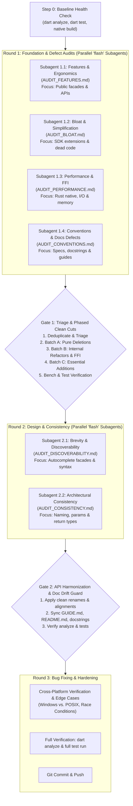

# Multi-Agent Audit & Modernization Workflow

This document defines the structured, three-round auditing and refinement workflow for the codebase. Orchestrating agents must execute this pipeline sequentially, spawning dedicated subagents for each audit domain, persisting findings into structured Markdown reports, and gating progression between rounds.

---

## Core Operating Principles

1. **Clean-Cut Policy (Zero Deprecations)**:
   - This is a personal project. **Never** use `@Deprecated` annotations, backward-compatibility wrapper shims, or legacy aliases.
   - When an API or extension is removed or renamed, make a clean cut: delete or rename it immediately, and update all call sites, examples, and tests across `lib/`, `bin/`, `tool/`, and `test/`.
2. **Gate 1 Triage Priority**:
   - When recommendations from different audit streams conflict, apply strict prioritization:
     $$\text{Bloat Pruning} > \text{API Ergonomics} > \text{Performance} > \text{Speculative Features}$$
   - Only accept new features if they fill genuine standard capabilities (e.g. streaming, missing HTTP verbs, DOM selectors), never speculative "nice-to-haves".
3. **Full Stack & Cross-Platform Scope**:
   - Audits cover the entire repository: Dart libraries (`lib/`), CLI tools (`bin/`), test suites (`test/`), internal tooling (`tool/`), specifications (`CONVENTIONS.md`, `GUIDE.md`), and native Rust FFI code (`native/src/*.rs`, `Cargo.toml`).
   - Cross-platform parity (Windows cmd/PowerShell vs. POSIX bash, path separators, file locking, and line endings) is a primary requirement.
4. **Benchmark Guardrail**:
   - Any performance refactor proposed by Subagent 1.3 must be benchmarked using `dart run tool/bench.dart`. If performance gains are negligible (<5%) but readability or maintainability suffers, reject the change.
5. **Model Tiering for Efficiency**:
   - Spawning subagents for scanning and auditing should use fast, wide-context models (`Model: 'flash'`).
   - Complex code implementation, architectural synthesis, and triage at Gates 1, 2, and 3 run on `inherit` (or `pro`).

---

## Workflow Architecture Overview



---

## Step 0: Baseline Health Check

Before spawning subagents:
1. Run `dart analyze` to ensure zero pre-existing compilation issues.
2. Run `dart test` to ensure the baseline test suite passes.
3. If native library binaries are missing or outdated, run `dart run tool/build_native.dart`.
4. Run `dart run tool/bench.dart` to establish baseline timing numbers.

---

## Standardized Audit Item Schema

All subagents **must** format every finding in their respective `AUDIT_*.md` files using this exact structure to facilitate systematic review:

```markdown
### [TAG-01] Short Descriptive Title
- **Location**: `lib/src/path/to/file.dart#L12-L34` or `native/src/...` or `CONVENTIONS.md#L...`
- **Severity**: High | Medium | Low
- **Problem**: Concise description of the defect, friction, bloat, or inefficiency.
- **Proposed Solution**: Exact code diff, replacement signature, or revised convention.
- **Rationale & Impact**: Concrete benefit (e.g. autocompletion clarity, memory reduction, cross-platform safety).
```

---

## Round 1: Foundation Audits (Parallel Subagents)

The lead agent spawns four independent subagents concurrently (`Model: 'flash'`). To eliminate redundant scanning overhead, each subagent is assigned a targeted domain:

### Subagent 1.1: Missing Features & API Ergonomics
- **Role**: `Feature & Ergonomics Auditor`
- **Output Target**: `AUDIT_FEATURES.md`
- **Target Matrix**:
  - Public facades: `lib/*.dart`
  - High-level domains: `lib/src/http/`, `lib/src/formats/`, `lib/src/chrome/`, `lib/src/cli/`
- **Scope**:
  - Identify missing capabilities compared to modern toolkits (e.g. streaming transformations, HTTP verb coverage, compression formats, XPath/DOM queries).
  - Identify clunky, verbose, or high-friction API signatures (redundant parameter requirements, lack of factory constructors, awkward type conversions).
  - Propose clean, expressive method signatures and realistic usage examples.

### Subagent 1.2: Bloat & Code Simplification
- **Role**: `Bloat & Simplification Auditor`
- **Output Target**: `AUDIT_BLOAT.md`
- **Target Matrix**:
  - Core type extensions: `lib/src/core/`, `lib/src/fs/path.dart`
  - Internal abstractions: `lib/src/async/`, `lib/src/collection/`, `lib/src/process/`
- **Scope**:
  - Identify loose extensions on primitive SDK types (`String`, `List`, `Map`, `int`) that pollute global autocompletion without strong justification.
  - Identify redundant methods, unnecessary overloads, duplicate helper classes, and dead code paths.
  - Recommend exact items to prune completely under the **Clean-Cut Policy**.

### Subagent 1.3: Performance & Native FFI Optimization
- **Role**: `Performance & FFI Auditor`
- **Output Target**: `AUDIT_PERFORMANCE.md`
- **Target Matrix**:
  - Native Rust code: `native/src/*.rs`, `native/Cargo.toml`
  - FFI boundaries & workers: `lib/src/hash/native.dart`, `lib/src/fs/archive.dart`, `lib/src/async/pool.dart`
  - Hot loops & I/O pipelines: `lib/src/fs/`, `lib/src/process/`
- **Scope**:
  - Identify hot-path bottlenecks, unnecessary intermediate memory allocations, and redundant buffer copies.
  - Review pointer allocations (`NativeBridge.alloc`), copying overhead, and isolate boundary costs.
  - Verify findings against `tool/bench.dart` metrics.

### Subagent 1.4: Conventions & Documentation Defects
- **Role**: `Conventions & Specs Auditor`
- **Output Target**: `AUDIT_CONVENTIONS.md`
- **Target Matrix**:
  - Guidelines & documentation: `CONVENTIONS.md`, `GUIDE.md`, `README.md`
  - Public docstrings: library-level and class-level doc comments across all `lib/*.dart` and `lib/src/`
- **Scope**:
  - Audit `CONVENTIONS.md`, `GUIDE.md`, `README.md`, and docstrings for internal defects, obsolete advice, and self-contradictory rules.
  - Scrutinize whether any written conventions are themselves defective, dogmatic, or counter-productive (e.g. banning necessary abstractions, enforcing brittle patterns, or assuming POSIX-only environments).
  - Identify gaps where conventions are silent or ambiguous, causing divergent implementations across modules.
  - Validate that documented code snippets match actual current runtime signatures and behavior.

---

## Gate 1: Implementation & Phased Clean Cuts

Before proceeding to Round 2, the lead agent executes a phased consolidation:

1. **Deduplication & Triage (5 mins)**:
   - Merge overlapping findings across the four `AUDIT_*.md` files.
   - Apply the **Gate 1 Triage Priority Rule**: Bloat Pruning > Ergonomics > Performance > Speculative Features.
2. **Batch A (Pure Deletions & Clean Cuts)**:
   - Delete dead code, duplicate helpers, and polluting extensions immediately without `@Deprecated` shims.
   - Verify with `dart analyze` and `dart test`.
3. **Batch B (Internal Refactors & FFI Optimizations)**:
   - Apply accepted performance improvements and FFI memory optimizations.
   - Benchmark with `dart run tool/bench.dart` to verify real gains.
   - Verify with `dart test`.
4. **Batch C (Essential Feature Additions)**:
   - Implement accepted high-value ergonomic additions with accompanying tests.
   - Update `CONVENTIONS.md` to fix any spec defects.
   - Verify with `dart test`.
5. **Clean Up**:
   - Delete intermediate Round 1 audit files once all accepted items are committed.

---

## Round 2: API Refinement & Consistency (Parallel Subagents)

Once the core foundation, bloat, performance, and conventions have been resolved in Round 1, the lead agent spawns two focused subagents (`Model: 'flash'`).

### Subagent 2.1: API Brevity & Discoverability
- **Role**: `Discoverability Auditor`
- **Output Target**: `AUDIT_DISCOVERABILITY.md`
- **Scope**:
  - Evaluate how easy it is for an engineer starting from an empty file to discover functionality via autocomplete facades (e.g. `Http.*`, `Doc.*`, `Shell.*`, `Hash.*`, `Path.*`).
  - Balance brevity with discoverability: ensure concise syntax without polluting primitive types.
  - Identify hidden or hard-to-find features that lack discoverable entry points.

### Subagent 2.2: Architecture & Convention Consistency
- **Role**: `Consistency Auditor`
- **Output Target**: `AUDIT_CONSISTENCY.md`
- **Scope**:
  - Audit naming conventions across all modules (e.g. `ConsoleTheme` vs. `TuiTheme`, verb names in HTTP vs. Client).
  - Verify parameter ordering conventions across related functions.
  - Audit return type semantics (nullable vs non-nullable exceptions, `Either` vs thrown errors).
  - Ensure uniform adherence to the updated repository conventions in `CONVENTIONS.md`.

---

## Gate 2: Implementation & Doc Drift Guard

Before proceeding to Round 3:
1. The lead agent reviews `AUDIT_DISCOVERABILITY.md` and `AUDIT_CONSISTENCY.md`.
2. Apply API renames, facade additions, and consistency alignments (clean cuts only, no deprecated shims).
3. **Documentation Drift Guard**:
   - Update all examples in `GUIDE.md`, `README.md`, and docstrings to reflect new names and signatures.
   - Verify no outdated API references remain.
4. Verify with `dart analyze` and relevant test suites.
5. Clean up Round 2 audit files.

---

## Round 3: Bug Fixing & Hardening

Round 3 focuses on correctness, reliability, and edge-case testing:
1. **Edge Case & Cross-Platform Resolution**:
   - Address silent failures, unhandled stream cancellations, and race conditions.
   - Audit cross-platform compatibility:
     - Windows cmd/PowerShell built-ins, batch files, quoting rules, and AutoRun registry immunity (`/d /c`).
     - POSIX shell execution parity.
     - Windows path separators (`\` vs `/`), file locking semantics, and CRLF line endings.
   - Verify atomic I/O guarantees (temporary-write-and-rename replacement).
2. **Verification Suite**:
   - Run `dart analyze` to ensure 0 errors and 0 warnings.
   - Run `dart test` across all unit, integration, and platform tests.
3. **Completion**:
   - Delete any temporary scratch scripts or transient audit files.
   - Commit and push all verified changes with concise, informative commit messages.
