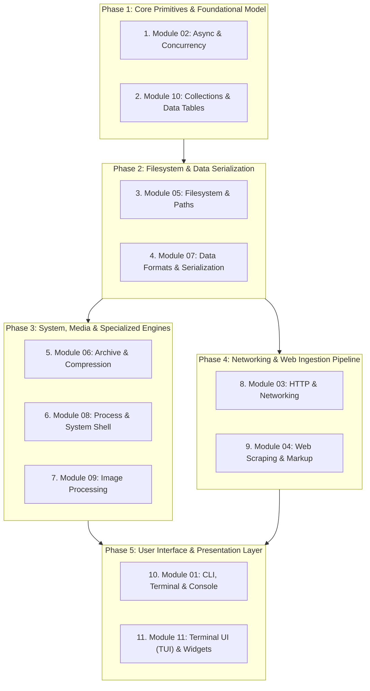

# Proposals Review Order & Architectural Guide

This document establishes the recommended review order for the architecture and module proposals in this repository. 

The sequence is organized **bottom-up by architectural layer and dependency hierarchy**—starting with foundational async and data models, moving through filesystem, system I/O, and networking pipelines, and culminating in user-facing CLI and TUI presentation layers.

---

## Review Hierarchy

---

## Detailed Review Breakdown & Rationale

### Phase 1: Core Primitives & Foundational Model
*Review these first because almost all higher-level modules rely on the execution and collection models defined here.*

1. **[02_async_and_concurrency.md](./02_async_and_concurrency.md)** (`lib/async.dart`, `lib/core.dart`)
   - **Focus**: `Task`, `Batch`, `items.batch()`, persistent isolate worker pools and durable job queues (`Pool`, `Job`, `Store`), and ambient scoped cancellation (`Cancel.scope`).
   - **Rationale**: Establishes the core execution model referenced by HTTP downloads, web scraping, archive processing, and CLI progress visualization.

2. **[10_collection_and_table.md](./10_collection_and_table.md)** (`lib/collection.dart`)
   - **Focus**: Functional collection extensions (`groupBy`, `chunked`, `sliding`, `distinctBy`, `sumBy`) and declarative `Table.from` projection and export (`toMarkdown`, `toCsv`).
   - **Rationale**: Supplies standard data manipulation and table structures used in reports, metrics, and CLI displays.

---

### Phase 2: Filesystem & Data Serialization
*Fundamental I/O building blocks for persistent storage, format conversions, and configuration management.*

3. **[05_fs_and_path.md](./05_fs_and_path.md)** (`lib/path.dart`)
   - **Focus**: Pure `Path` abstractions, atomic I/O (`writeJson`, `readJson`, `readLines`), directory lifecycles (`tempDir`, `ensureDir`, `emptyDir`), globbing, duplicate detection, and file system watching.
   - **Rationale**: Foundational filesystem layer used by archives, image processing, process pipelines, and download destinations.

4. **[07_formats_and_data.md](./07_formats_and_data.md)** (`lib/json.dart`, `lib/xml.dart`, `lib/xpath.dart`, `lib/src/formats/*`)
   - **Focus**: Unified symmetrical parsing/serialization (`parseJson`, `parseYaml`, `parseToml`, `parseXml`), `JsonDoc` dynamic dot-notation access, and JSONPath/XPath evaluation.
   - **Rationale**: Standardizes structured data exchange across network payloads, local configurations, and document parsing.

---

### Phase 3: System, Media & Specialized Engines
*Specialized engines extending filesystem paths, subprocesses, and native media manipulation.*

5. **[06_archive_and_compression.md](./06_archive_and_compression.md)** (`lib/archive.dart`)
   - **Focus**: Direct archive creation and decompression (`zipTo`, `unzipTo`, `tarGzTo`, `untarTo`, `tarZstTo`) on `Path`, in-memory archive entry inspection, and progress tracking.
   - **Rationale**: Directly builds upon `Path` and async progress events.

6. **[08_process_and_shell.md](./08_process_and_shell.md)** (`lib/process.dart`)
   - **Focus**: Subprocess invocation extensions (`runText`, `runOk`, `runLines`), UNIX-style pipe operator (`cmd1 | cmd2`), real-time stdout/stderr line streaming, and shell argument escaping.
   - **Rationale**: Provides process lifecycle management and pipeline orchestration.

7. **[09_image_processing.md](./09_image_processing.md)** (`lib/image.dart`)
   - **Focus**: Native FFI memory-safe `Image.pipeline`, thumbnail generation on `Path`, fast format converters (`toWebp`, `toJpeg`, `toPng`), and zero-decode EXIF/dimension readers.
   - **Rationale**: High-performance media engine building on `Path` with strict native resource cleanup.

---

### Phase 4: Networking & Web Ingestion Pipeline
*Network I/O and web content extraction engines.*

8. **[03_http_and_networking.md](./03_http_and_networking.md)** (`lib/http.dart`)
   - **Focus**: Direct typed HTTP methods (`getJson`, `postJson`, `getHtml`), fluent URL builder (`/` and `&`), streaming downloads with progress (`downloadTo`), and scoped configurations (`Http.scope`).
   - **Rationale**: Connects `Uri` manipulation with `Task`, `Path`, and data format parsing.

9. **[04_scrape_and_markup.md](./04_scrape_and_markup.md)** (`lib/scrape.dart`, `lib/html.dart`, `lib/xml.dart`, `lib/xpath.dart`)
   - **Focus**: CSS selector batch extraction (`texts`, `attrs`), null-safe element lookups (`find`), XPath queries, and declarative recursive web crawling (`site.crawl`).
   - **Rationale**: Builds on HTTP responses and markup parsing to create a unified data extraction engine.

---

### Phase 5: User Interface & Presentation Layer
*The top-level interaction surface combining all underlying features into cohesive terminal experiences.*

10. **[01_cli_and_console.md](./01_cli_and_console.md)** (`lib/cli.dart`)
    - **Focus**: Fluent CLI option & argument definitions, nested subcommands, dynamic spinners (`Console.spinner`), parallel progress bars (`Console.progress`), interactive prompts (`Console.choose`, `Console.multi`), and clean themes.
    - **Rationale**: Surfaces command-line routing, prompts, and visual feedback for `Task` and `Batch` operations.

11. **[11_tui_and_widgets.md](./11_tui_and_widgets.md)** (`lib/tui.dart`)
    - **Focus**: Declarative Elm/Flutter-style full-screen terminal applications (`Tui.app`), responsive layout widgets (`VStack`, `HStack`, `Expanded`), sub-millisecond cell buffer diffing, and modal dialog overlays (`Tui.alert`, `Tui.confirm`).
    - **Rationale**: The most advanced visual presentation layer in the toolkit.
